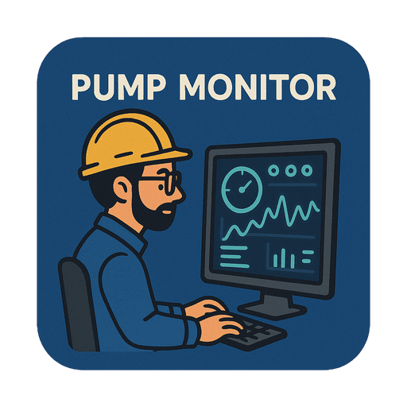

# Pump Monitor
**Slogan**: Real‑Time Data. Reliable Storage. 

**Logo**: 

            
          
  

---

## 🔹 About the Project
**Pump Monitor** is a Java desktop application to monitor various industrial systems by displaying real-time sensor data from Arduino and storing it in a database for analysis and record-keeping.

### 📌 What does this project cover
✔ **JavaFX with FXML** for a responsive, user-friendly UI  
✔ **JDBC with MySQL** for saving and storing data in a database management system  
✔ **Singleton & MVC design patterns** for scalability and maintainability  
✔ **SOLID Principles** for clean architecture  
✔ **Concurrency & Multithreading** To display all data in real time and in a flexible manner

---

## 🎯 Key Features

🔴 Real-Time Monitoring
Instantly displays live readings from multiple sensors (current, pressure, temperature, vibration, etc.) for each pump.

📡 Arduino Integration
Seamlessly connects with Arduino hardware to collect sensor data from industrial systems.

📊 Visual Dashboard
Clean, intuitive UI with circular progress indicators and level gauges for fast status recognition.

💾 Reliable Data Storage
Automatically saves all collected data in a secure database for future analysis and reporting.

📅 Time-Stamped Records
Tracks and logs every reading with a timestamp, helping in trend analysis and maintenance planning.

⚠️ Alert Indicators
Color-coded warnings (red, yellow, green) highlight abnormal conditions for quick action.

🧱 Multi-Pump Support
Monitors multiple pumps at once with clearly separated panels for each unit.

📈 Historical Analysis (optional/future)
Easily extendable for trends, graphs, and predictive maintenance features using stored data.

---

## 💡Mission

Pump Monitor’s mission is to empower industrial operations with accurate real-time monitoring of pump performance by seamlessly integrating sensor data from microcontroller devices and storing it securely in a robust database system. Our goal is to enable informed decisions, prevent equipment failure, and maximize operational efficiency.

---

## 🎯Vision

Pump Monitor’s vision is to become the industry standard for pump monitoring solutions by delivering intuitive, scalable, and data-driven insights—ensuring reliability, safety, and sustainability across water management and industrial systems worldwide.

---

## 🗣️Slogan

**Real‑Time Data. Reliable Storage** 

Pump Monitor provides live pump data with secure storage, ensuring instant insights and long-term reliability.

---

## 📜 Technology Summary

| **Category**             | **Technology Used**                                   |
| ------------------------ | ----------------------------------------------------- |
| **Programming Language** | Java                                                  |
| **Frontend (GUI)**       | JavaFX, FXML, CSS                                     |
| **Backend**              | Exception Handling, Generics, Lambda Expressions, Collections, Stream API, Concurrency & Threads|
| **Database**             | MySQL, JDBC, DAO Pattern                              |
| **Software Engineering** | MVC, Singleton, SOLID Principles          |
| **Project Management**   | Maven       |
| **Version Control**      | Git & GitHub|

---

## 💻 User Interface

 

---
## 🙏 Thank You

Thank you for taking the time to view this project!
 

